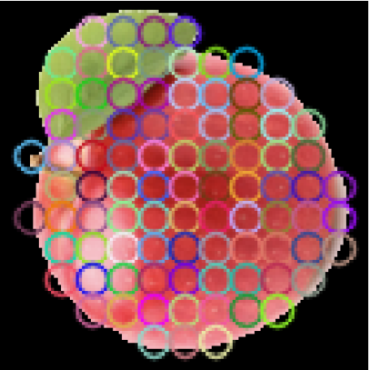
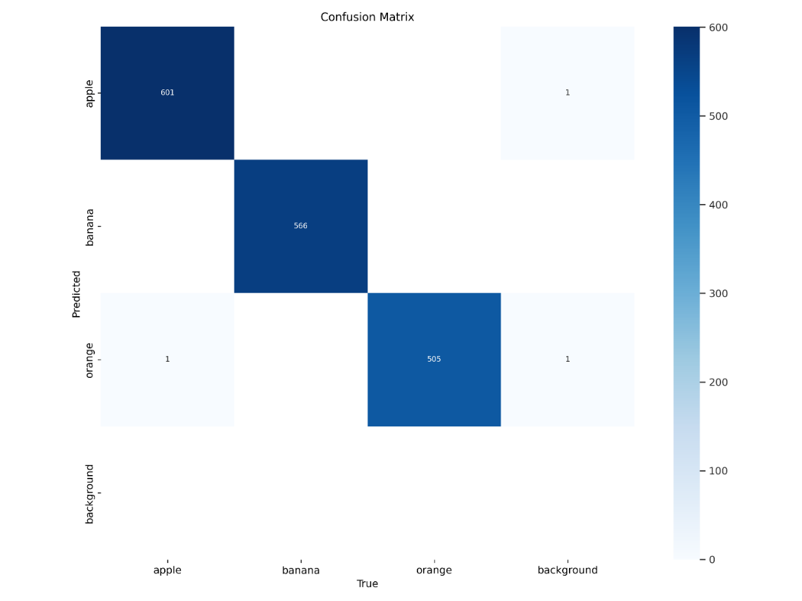
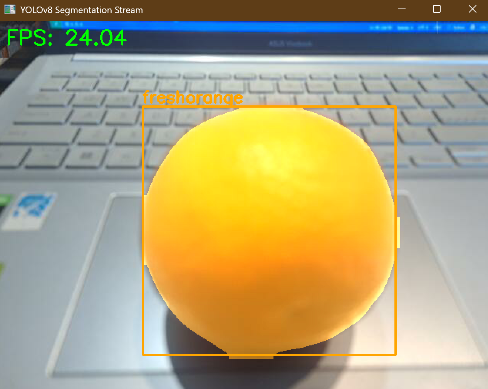

## Introduction

This project focuses on building a fruit classification system, mainly targeting apples, oranges, and bananas.
The core of the system is a YOLOv8 segmentation model, which is used to accurately segment the shape of each fruit from the image.

After obtaining precise fruit masks, the Watershed segmentation algorithm is applied to further analyze the segmented regions, with a particular emphasis on identifying and separating damaged or rotten areas on the fruit surface.
By combining deep learning–based segmentation with classical image processing techniques, the project aims to achieve robust and interpretable fruit quality assessment.
## Dense SIFT and Region of Interest (ROI)

To help the model focus on the fruit itself, the dataset is preprocessed to remove unnecessary background information.

Since the dataset is already well segmented, simple image processing methods such as thresholding are used to generate binary masks of the fruit regions. These masks allow us to separate the fruit from the background.

After obtaining the binary mask, the bitwise_and operation is applied to extract the Region of Interest (ROI). This ensures that feature extraction is performed only on the fruit area, reducing the influence of background noise.

Finally, the extracted ROI images are used for Dense SIFT feature extraction, as shown in the example below:
<p align="center">
  
  <br>
  <em>ROI extraction after thresholding and masking</em>
</p>

## Model training

To speed up the training process, you can use free GPU services such as Google Colab or Kaggle Notebooks.
In this project, Kaggle Notebook is used due to its better server stability.

First, upload the dataset to Google Drive and obtain the file ID so that Kaggle can download the dataset.
```bash
!pip install gdown
!gdown --id <your_key>
```
After downloading the dataset to Kaggle, the model can be trained using the following configuration:
```bash
from ultralytics import YOLO

model = YOLO("yolov8s-seg.pt")

model.train(
    data="/kaggle/working/dataset-seg/data.yaml",
    epochs=100,
    imgsz=640,
    batch=16,
    device='cuda',
    save=True,
    val=True,
    plots=True,
    verbose=True,
    workers=4,
    augment=True
)
```
Once training is completed, a runs directory will be generated, containing all training logs, results, and the trained model weights.
To download this directory to your local machine, follow the steps below:

***Compress the `runs/` directory***
```bash
!zip -r yolov8s-seg.zip runs/
```
***Create a download link***
```bash
from IPython.display import FileLink

FileLink('yolov8s-seg.zip')
```
#### Notes
- Make sure your Google Drive link is set to public access
- **Update the dataset paths in the `data.yaml` file to match the Kaggle directory structure**

### Confusion Matrix

<p align="center">
  
  <br>
  <em>Confusion Matrix of YOLOv8-seg</em>
</p>

The confusion matrix indicates that the model classifies apples, bananas, and oranges with high accuracy. Most predictions fall on the diagonal, showing correct classification, with only a few misclassifications involving the background. Overall, the model demonstrates strong and reliable performance across all fruit classes.
## Result

<p align="center">
  
  <br>
  <em>Fresh orange detection</em>
</p>

The results are promising, with a high frame rate of approximately **24 FPS** on an *NVIDIA GTX 3080 (CUDA)*, which is sufficient for real-time performance.   
## Watershed Segmentation

After obtaining the binary masks from the YOLOv8 segmentation model, the Watershed segmentation algorithm is applied to detect damaged regions on the fruit surface. However, the parameters for the Watershed process have not yet been fully optimized, so the damaged area segmentation results are still limited and do not meet the expected performance.
<p align="center">
  
  <br>
  <em>Watershed Segmentation</em>
</p>

## How to use my code

**Clone my repo:**
```bash
git clone https://github.com/minhthong2514/Fruits-Rotten-Detection.git
```
**Feature extraction:**
```bash
python3 ROI_Mask.py
```
**Run file `main.py`**
```bash
python3 main.py
```